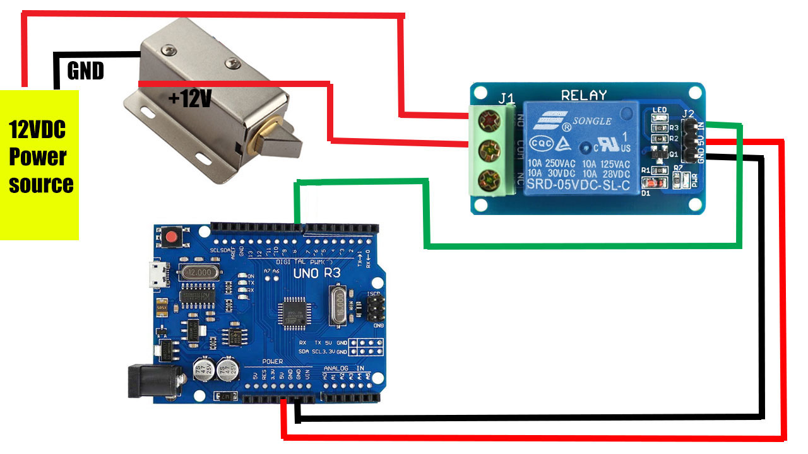
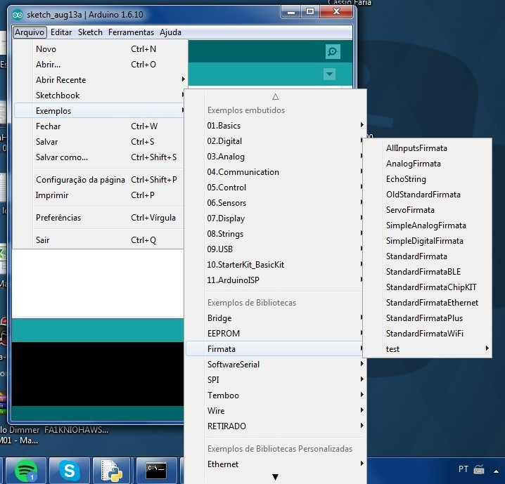

# Face Access
Basic example of access control with face recognition
  * MIT License
  * LGPDP Brasil Safe (Lei Geral de Proteção de Dados Pessoais)

### TODO List
- [x] Basic command line interface
- [x] Face recogniton from Webcam
- [x] Just use the photo once for register, after that discard. Save only a id on the local file database (LGPDP Brasil Safe).
- [x] OneTimePassword with Google Authenticator
- [ ] Text to Speech for welcome audio message
- [x] Arduino commands to open the door
- [x] Qr-Code to easy registration and temporary access
- [ ] Audio code (CHIRP) to easy registration and temporary access

### Improvements
- [x] Multithread support
- [x] GPU support
- [ ] Improve performance with Region Of Interest method (https://github.com/hrastnik/face_detect_n_track)


*Easy QR-Code face register demonstration


# Technologies and Libraries
* [Python 3](https://www.python.org/)
* [OpenCV](https://opencv.org/)
* [dlib](http://dlib.net/)
* Face Recognition ([ageitgey](https://github.com/ageitgey/face_recognition))
* Arduino ([pyfirmata2](https://pypi.org/project/pyFirmata2))
* Fernet Cryptography ([cryptography](https://cryptography.io/en/latest))
* Google Text 2 Speech ([gTTS](https://pypi.org/project/gTTS))
* QR-Code ([pyZbar, pyqrcode, pypng](https://www.youtube.com/watch?v=1_q2dCphf50))
* Audio-Code ([Chirp](https://developers.chirp.io/docs))

# Requirements
  * Python 3.6+
  * Cmake(Linux and Windows) or XCode (MacOS)
  * MacOS or Linux (Tested with Ubuntu 18.04).
    * Windows not officially supported by DLib and Face Recoginition library, but might work (slowly)
  * I strongly recommend that you use a package manager like Homebrew (MacOS), apt-get (Ubuntu) and Chocolatey (Windows)


# Easy install
You can copy and paste these commands to install all lib dependencies for once or going step-by-step.

*if **pip3** command not working use **pip** instead

## MacOS
```bash
/usr/bin/ruby -e "$(curl -fsSL https://raw.githubusercontent.com/Homebrew/install/master/install)"
xcode-select --install
brew install cmake python3 zbar portaudio libsndfile -Y
pip3 install virtualenv
virtualenv cv
source cv/bin/activate
pip3 install opencv-contrib-python dlib face_recognition pyfirmata2 cryptography gTTS pyotp pyzbar pyqrcode pypng chirpsdk
```
## Ubuntu
```bash
sudo apt update
sudo apt upgrade
sudo apt-get install build-essential cmake python3 python3-pip libzbar-dev libzbar0 python3-dev python3-setuptools portaudio19-dev libffi-dev libsndfile1
pip3 install virtualenv
virtualenv cv
source cv/bin/activate
pip3 install opencv-contrib-python dlib face_recognition pyfirmata2 cryptography gTTS pyotp pyzbar pyqrcode pypng chirpsdk
```
## Windows
*Go step-by-step

# Install (step-by-step)

## Package Manager installation
### Homebrew (Mac)
```bash
/usr/bin/ruby -e "$(curl -fsSL https://raw.githubusercontent.com/Homebrew/install/master/install)"
```
### Update apt (Ubuntu)
```bash
sudo apt update
sudo apt upgrade
```
### Chocolatey (Windows)
```cmd
@"%SystemRoot%\System32\WindowsPowerShell\v1.0\powershell.exe" -NoProfile -InputFormat None -ExecutionPolicy Bypass -Command "iex ((New-Object System.Net.WebClient).DownloadString('https://chocolatey.org/install.ps1'))" && SET "PATH=%PATH%;%ALLUSERSPROFILE%\chocolatey\bin"
```

## Cmake / XCode
### MacOS
* Install XCode from App Store

then:
```bash
xcode-select --install
```
```bash
brew install cmake
```
### Ubuntu
```bash
sudo apt install build-essential cmake
```

### Windows
* Install Visual Studio **with Visual C++ Build Tools 2015**

  https://visualstudio.microsoft.com

* install Cmake:
```cmd
choco install cmake -Y
```

Or manually install from: https://cmake.org/download/

*Add Cmake installation directory path to System path.
* [How to add directories to System path?](https://www.howtogeek.com/118594/how-to-edit-your-system-path-for-easy-command-line-access/)

## Python 3.6+ with PIP
*I strongly recomend you to know about (and maybe use) [Virtual Enviroments](https://www.geeksforgeeks.org/python-virtual-environment/)

*if **pip3** command not working use **pip** instead
### MacOS
```bash
brew install python3
```
*[more details..](https://wsvincent.com/install-python3-mac/)
### Ubuntu
```bash
sudo apt install python3 python3-pip
```
### Windows
```cmd
choco install python3 -Y
```

## Virtual Enviroments
*It's optional, but I strongly recomend you to know about (and use) [Virtual Enviroments](https://www.geeksforgeeks.org/python-virtual-environment/)

The **virtualenv** lib is a tool to create isolated Python environments. virtualenv creates a folder which contains all the necessary executables to use the packages that a Python project would need.

Installation:
```bash
pip3 install virtualenv
```
You can create a virtualenv using the following command (*choose a name, I used cv):
```bash
virtualenv cv
```
Activate it:
```bash
source cv/bin/activate
```
Now **ALL** pip libraries will be installed isolated inside the environment. It'll look like this:

**(cv)$ pip3 install ...**

If you want to deactivate:

**(cv)$ deactivate**

Command:
```bash
deactivate
```

## OpenCV
Install this module from pypi using `pip`:
```bash
pip3 install opencv-contrib-python
```
*[Complete Tutorial from pyimagesearch](https://www.pyimagesearch.com/2018/09/19/pip-install-opencv/)

## DLib + Face Recognition (ageitgey)  
### MacOS or Linux
```bash
pip3 install dlib
```
*[How to install dlib from source on macOS or Ubuntu](https://gist.github.com/ageitgey/629d75c1baac34dfa5ca2a1928a7aeaf)

Then, install this module from pypi using `pip`:

```bash
pip3 install face_recognition
```

### Windows
While Windows isn't officially supported, helpful users have posted instructions on how to install this library:
  * [@masoudr's Windows 10 installation guide (dlib + face_recognition)](https://github.com/ageitgey/face_recognition/issues/175#issue-257710508)
  
## Arduino control with pyFirmata2
You will need an Arduino Board like Uno, Mega, Micro, Nano with a relay module and a solenoid Door lock to control the access.


Install Arduino IDE and use the Example Firmata > StandardFirmata on the board.


The board need to stay connected over USB.
All the Arduino (GPIO) control will be done by the python code.


### pip command
```bash
pip3 install pyfirmata2
```

## Google Text 2 Speech
### pip command
```bash
pip3 install gTTS
```

## Google One Time Password (Google Authenticator)
### pip command
```bash
pip3 install pyotp
```

## QR-Code
### MacOS
```bash
brew install zbar
```
### Ubuntu
```bash
sudo apt-get install libzbar-dev libzbar0
```
### Windows
```cmd
choco install zbar -Y
```
### pip command
```bash
pip3 install pyzbar pyqrcode pypng
```

## Audio Code - CHIRP
You will need generate keys to use this lib.
[Official instructions] (https://developers.chirp.io/docs/getting-started/python)

### MacOS
```bash
brew install portaudio libsndfile
```
### Ubuntu
```bash
sudo apt-get install python3-dev python3-setuptools portaudio19-dev libffi-dev libsndfile1
```
### Windows
* Download sounddevice (last whl file version) from the link below
https://www.lfd.uci.edu/~gohlke/pythonlibs/#sounddevice
* From the file path:
```cmd
pip install sounddevice_file_name.whl
```
*Replace the file name with the same of the downloaded file

### pip command
```bash
pip3 install chirpsdk
```
# After installation
To start, with terminal go to folder path and execute:
```bash
python main.py
```

## CLI commands:
If everything is right, a new window with the webcam streaming and face recognition will start.
In the terminal you should see somethong like: 

**CMD:**

*Don't use spaces **BETWEEN** parameters, they are separated by comma (,). But you can use spaces **IN** parameter, like: Firstname Middlename Lastname..

### Where you can do some actions like:
**Add a new face id from a image file in the folder images:**
```bash
add,Joseph Smith,images/joseph.jpg
```
**Add a new face id from the current webcam capture:**
```bash
add,Joseph Smith
```
**List the current face ids:**
```bash
print
```
**Remove a face id:**
```bash
del,Joseph Smith
```
**Exit:**
```bash
q
```
or
```bash
quit
```
